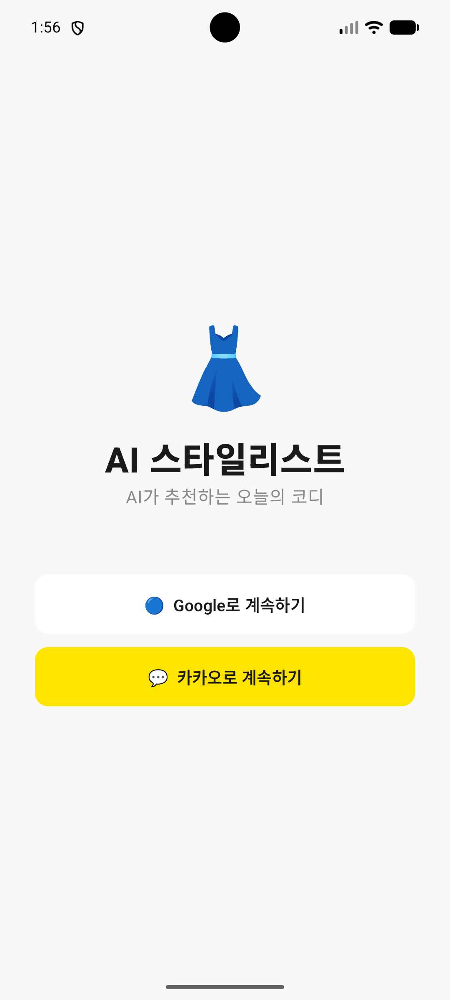
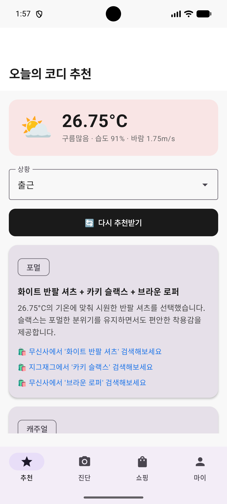
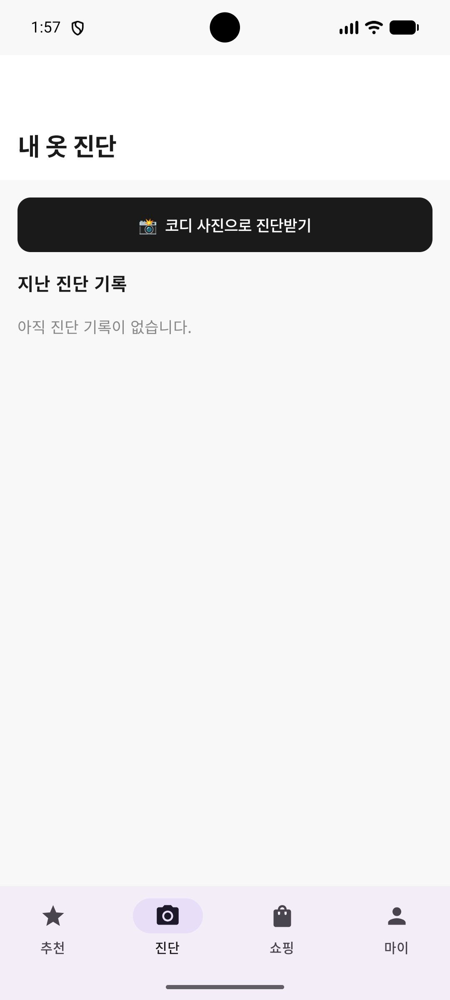
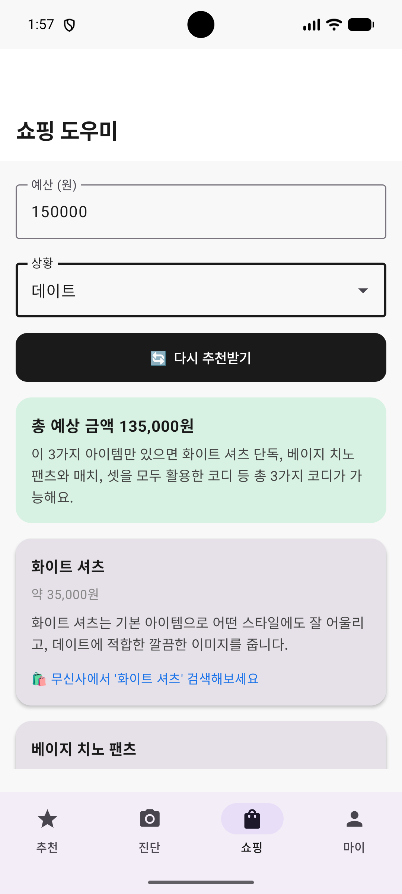
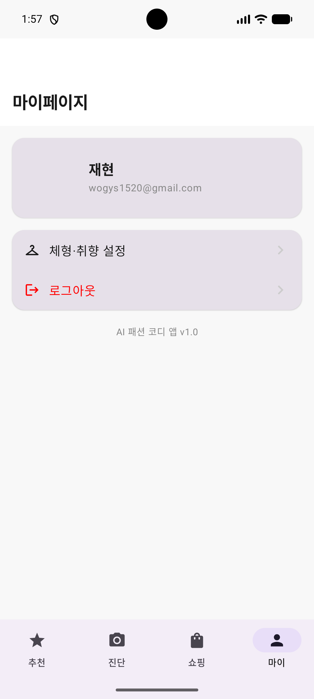

# 👗 AI 스타일리스트

> 옷에 대한 지식이 없어도 날씨/상황/체형에 맞는 코디를 추천받고,
> 내 코디를 진단받고, 필요한 옷을 쇼핑까지 이어갈 수 있는 AI 패션 앱

---

## 목차

- [서비스 소개](#서비스-소개)
- [스크린샷](#스크린샷)
- [기술 스택](#기술-스택)
- [아키텍처](#아키텍처)
- [ERD](#erd)
- [주요 기능](#주요-기능)
- [API 명세](#api-명세)
- [프로젝트 구조](#프로젝트-구조)
- [실행 방법](#실행-방법)
- [성능 측정](#성능-측정)
- [트러블슈팅](#트러블슈팅)
- [개발 로드맵](#개발-로드맵)

---

## 서비스 소개

패션에 무지한 사람도 부담 없이 스타일링을 받을 수 있도록 만든 AI 스타일리스트 앱입니다.  
구글 / 카카오 소셜 로그인으로 간편하게 시작할 수 있으며, 핵심 기능은 3가지입니다.

1. **오늘의 코디 추천** — 날씨(자동) + 상황 + 체형/취향 프로필을 바탕으로 AI가 코디를 텍스트로 추천하고, "무신사/지그재그에서 ○○ 검색해보세요" 형태의 쇼핑몰 검색 제안까지 함께 제공합니다.
2. **내 옷 진단** — 오늘 입은 코디 사진을 올리면 AI가 0~100점으로 점수를 매기고, 개선 제안과 비슷한 스타일을 추천해줍니다.
3. **쇼핑 도우미** — 예산과 상황, 체형/취향을 입력하면 AI가 구체적인 아이템과 쇼핑몰 검색 제안, "이것만 사면 N가지 코디가 가능해요" 같은 활용법을 제시합니다.

> 옷장 등록/관리나 코디 캘린더 없이도, 사용자가 자기 옷을 일일이 등록하지 않아도 바로 추천을 받을 수 있도록 설계했습니다.

---

## 스크린샷

| 로그인 | 오늘의 코디 추천 |
|:---:|:---:|
|  |  |
| Google / 카카오 소셜 로그인 화면 | 날씨 카드 + 상황 선택 + AI 코디 추천 + 쇼핑몰 검색 제안 |

| 내 옷 진단 | 쇼핑 도우미 |
|:---:|:---:|
|  |  |
| 코디 사진으로 AI 점수/피드백 진단받기 | 예산 + 상황 입력 → AI 아이템 추천 + 활용법 |

| 마이페이지 |
|:---:|
|  |
| 프로필, 체형·취향 설정, 로그아웃 |

---

## 기술 스택

| 영역 | 기술 |
|------|------|
| 클라이언트 | Android (Kotlin + Jetpack Compose) |
| 백엔드 | Spring Boot (JWT, REST API) |
| AI 서버 | FastAPI (Python) |
| DB | PostgreSQL + Redis |
| 이미지 스토리지 | AWS S3 (코디 진단 사진 임시 저장) |
| 인프라 | AWS EC2 + Docker + GitHub Actions |
| 인증 | Spring Security OAuth2 Client (Google, Kakao) |
| AI API | OpenAI Vision API (코디 사진 진단, gpt-4o), OpenAI GPT-4o-mini (코디/쇼핑 추천 텍스트 생성), 기상청 API (날씨) |
| 네트워킹 | Retrofit + OkHttp |
| 비동기 | Kotlin Coroutines |

---

## 아키텍처

```
[Android 클라이언트]
      │
      │ HTTPS
      ▼
[Spring Boot — 메인 백엔드]  ──▶  [AWS S3] (코디 진단 사진 임시 저장)
      │              │
      │ AI 요청       │ DB 읽기/쓰기
      ▼              ▼
[FastAPI — AI 서버]    [PostgreSQL]
      │
      ▼
[외부 API]
  - OpenAI Vision API (코디 사진 진단: 점수 + 개선 제안)
  - OpenAI GPT-4o-mini (텍스트 — 오늘의 코디 추천 + 쇼핑몰 검색 제안, 쇼핑 도우미 아이템 추천)
  - 기상청 API (날씨)

[Redis] ◀── Spring Boot (세션, 날씨 캐싱)
[GitHub Actions] ──▶ AWS EC2 (CI/CD 자동 배포)
```

---

## ERD

### users
| 컬럼 | 타입 | 설명 |
|------|------|------|
| id | UUID PK | 사용자 ID |
| email | VARCHAR | 이메일 |
| nickname | VARCHAR | 닉네임 |
| profile_image_url | VARCHAR | 프로필 이미지 |
| provider | VARCHAR | 소셜 로그인 종류 (google/kakao) |
| provider_id | VARCHAR | 소셜 로그인 고유 ID |
| height | INTEGER | 키 (cm) |
| weight | INTEGER | 몸무게 (kg) |
| body_type | VARCHAR | 체형 (SLIM/NORMAL/MUSCULAR/CHUBBY) |
| preferred_style | VARCHAR | 선호 스타일 (CASUAL/FORMAL/SPORTY/STREET/VINTAGE/MINIMAL) |
| created_at | TIMESTAMP | 가입일 |
| updated_at | TIMESTAMP | 수정일 |

> 소셜 로그인 전용이므로 password_hash 없음

### style_diagnoses (내 옷 진단 기록)
| 컬럼 | 타입 | 설명 |
|------|------|------|
| id | UUID PK | ID |
| user_id | UUID FK | 사용자 |
| image_url | VARCHAR | 진단한 코디 사진 S3 URL |
| score | INTEGER | AI 코디 점수 (0~100) |
| feedback | TEXT | 개선 제안 텍스트 |
| similar_styles | TEXT | 비슷한 스타일 추천 목록 (JSON 직렬화) |
| created_at | TIMESTAMP | 진단일 |

> 오늘의 코디 추천 / 쇼핑 도우미는 실제 옷 소유 여부와 무관한 실시간 AI 텍스트 생성이라 별도 테이블에 저장하지 않고 매 요청마다 새로 생성합니다.

---

## 주요 기능

| 화면 | 설명 |
|------|------|
| 로그인 | 구글 / 카카오 소셜 로그인 |
| 오늘의 코디 추천 | 날씨 카드 + 상황 선택 + AI 코디 추천 텍스트 + 쇼핑몰 검색 제안(무신사/지그재그 등) |
| 내 옷 진단 | 코디 사진 촬영/업로드 + AI 점수(0~100) + 개선 제안 + 비슷한 스타일 추천 + 진단 이력 |
| 쇼핑 도우미 | 예산 + 상황 입력 + AI 추천 아이템 + 쇼핑몰 검색 제안 + 활용법("이것만 사면 N가지 코디") |
| 마이페이지 | 프로필 + 체형/취향 설정 + 로그아웃 |

---

## API 명세

### Auth

| Method | Endpoint | 설명 |
|--------|----------|------|
| GET | /oauth2/authorization/google | 구글 소셜 로그인 시작 (Spring Security OAuth2 리다이렉트) |
| GET | /oauth2/authorization/kakao | 카카오 소셜 로그인 시작 |
| POST | /api/auth/refresh | JWT 토큰 갱신 |
| POST | /api/auth/logout | 로그아웃 |

### User 🔒

| Method | Endpoint | 설명 |
|--------|----------|------|
| GET | /api/users/me | 내 프로필 조회 |
| PUT | /api/users/me | 프로필(체형/취향 포함) 수정 |

### Weather 🔒

| Method | Endpoint | 설명 |
|--------|----------|------|
| GET | /api/weather | 현재 날씨 조회 |

### Recommend (오늘의 코디 추천) 🔒

| Method | Endpoint | 설명 |
|--------|----------|------|
| POST | /api/outfits/recommend/situation | 날씨 + 상황 + 체형/취향 프로필 → AI 코디 텍스트 추천 + 쇼핑몰 검색 제안 |

### Diagnosis (내 옷 진단) 🔒

| Method | Endpoint | 설명 |
|--------|----------|------|
| POST | /api/diagnosis | 코디 사진 업로드 → S3 저장 → AI 점수(0~100) + 개선 제안 + 비슷한 스타일 추천 |
| GET | /api/diagnosis | 내 진단 이력 목록 |
| GET | /api/diagnosis/{id} | 진단 상세 조회 |

### Shopping (쇼핑 도우미) 🔒

| Method | Endpoint | 설명 |
|--------|----------|------|
| POST | /api/shopping/recommend | 예산 + 상황 + 체형/취향 → AI 아이템 추천 + 쇼핑몰 검색 제안 + 활용법 |

### AI 서버 (FastAPI, Spring Boot 내부 호출 전용)

| Method | Endpoint | 설명 |
|--------|----------|------|
| GET | /ai/weather | 현재 날씨 조회 (기상청 API) |
| POST | /ai/outfits/recommend/situation | 날씨 + 상황 + 체형 → 코디 텍스트 추천 + 쇼핑몰 검색 제안 |
| POST | /ai/diagnosis | 코디 이미지 → 점수 + 개선 제안 (OpenAI Vision) |
| POST | /ai/shopping/recommend | 예산 + 상황 + 체형 → AI 아이템 조합 추천 + 쇼핑몰 검색 제안 |

> 🔒 = JWT 인증 필요

---

## 프로젝트 구조

```
my-fashion-app/
├── android/                    # Kotlin + Jetpack Compose (실서비스 클라이언트)
│   └── app/src/main/java/com/fashionapp/
│       ├── data/
│       │   ├── api/            # Retrofit API 인터페이스
│       │   ├── model/          # 데이터 모델
│       │   ├── repository/     # Repository
│       │   └── datastore/      # 토큰 저장 (DataStore)
│       ├── di/                 # Hilt 모듈
│       └── ui/
│           ├── login/          # 소셜 로그인
│           ├── recommend/      # 오늘의 코디 추천
│           ├── diagnosis/      # 내 옷 진단
│           ├── shopping/       # 쇼핑 도우미
│           ├── mypage/         # 프로필, 체형/취향 설정
│           └── navigation/     # 하단 탭 네비게이션
│
├── backend/                    # Spring Boot
│   └── src/main/java/com/fashionapp/
│       ├── domain/
│       │   ├── user/           # 소셜 로그인, 프로필, JWT 인증
│       │   ├── weather/        # 날씨 프록시
│       │   ├── outfit/         # 오늘의 코디 추천
│       │   ├── diagnosis/      # 내 옷 진단
│       │   └── shopping/       # 쇼핑 도우미
│       ├── global/
│       │   ├── config/         # Security, CORS, RestClient 설정
│       │   ├── jwt/            # JWT 토큰 처리
│       │   └── exception/      # 글로벌 에러 핸들링
│       └── infra/
│           ├── S3Uploader.java       # 진단 사진 업로드
│           └── AiServerClient.java   # FastAPI 내부 호출
│
├── ai-server/                   # FastAPI (Python)
│   └── app/
│       ├── routers/             # recommend.py, diagnosis.py, shopping.py, weather.py
│       ├── services/            # recommend_service.py, diagnosis_service.py, shopping_service.py, weather_service.py
│       ├── schemas/             # Pydantic 모델
│       ├── core/                # config.py (환경변수)
│       └── main.py
│
├── performance/                  # k6 성능 측정 스크립트
├── docs/                         # 스크린샷, 트러블슈팅 문서
├── .github/workflows/            # GitHub Actions CI/CD
├── docker-compose.yml
└── CLAUDE.md
```

---

## 실행 방법

### 사전 요구사항

- Docker Desktop (PostgreSQL, Redis, AI 서버)
- Java 17+
- Android Studio (에뮬레이터 또는 실기기)

### 1. 환경변수 설정

**`backend/.env`**
```env
DB_URL=jdbc:postgresql://localhost:5432/fashionapp
DB_USERNAME=fashionapp
DB_PASSWORD=fashionapp
GOOGLE_CLIENT_ID=your_google_client_id
GOOGLE_CLIENT_SECRET=your_google_client_secret
KAKAO_CLIENT_ID=your_kakao_client_id
KAKAO_CLIENT_SECRET=your_kakao_client_secret
JWT_SECRET=your_jwt_secret
AWS_ACCESS_KEY=your_aws_access_key
AWS_SECRET_KEY=your_aws_secret_key
S3_BUCKET=your_s3_bucket_name
```

**`ai-server/.env`** (`.env.example` 참고)
```env
OPENAI_API_KEY=your_openai_api_key
WEATHER_API_KEY=your_kma_api_key
```

### 2. PostgreSQL 실행

```bash
docker run -d --name fashionapp-db -p 5432:5432 \
  -e POSTGRES_DB=fashionapp -e POSTGRES_USER=fashionapp -e POSTGRES_PASSWORD=fashionapp \
  postgres:16
```

### 3. Redis + AI 서버 (Docker Compose)

```bash
docker compose up -d
# AI 서버 코드를 수정한 경우 반드시 재빌드해야 반영됩니다
docker compose build ai-server && docker compose up -d ai-server
```

### 4. Spring Boot 백엔드

```bash
cd backend
./gradlew bootRun
# http://localhost:8080
```

### 5. Android 클라이언트

Android Studio에서 `android/` 폴더를 열고 에뮬레이터로 실행합니다.
에뮬레이터는 호스트 PC를 `10.0.2.2`로 접근하므로, OAuth2 로그인 테스트 시 아래 포트포워딩이 필요합니다.

```bash
adb reverse tcp:8080 tcp:8080
```

---

## 성능 측정

k6를 사용해 API 응답 시간·부하 테스트를 진행했습니다.

| 항목 | 결과 |
|------|------|
| DB 읽기 API 평균 응답시간 | 18ms |
| 날씨 API 평균 응답시간 | 235ms |
| AI 코디 추천 평균 응답시간 (GPT-4o-mini) | 5.6s |
| AI 쇼핑 추천 평균 응답시간 | 4.4s |
| 부하 테스트 (동시 사용자 50명) 평균 응답시간 | 93ms |
| 처리량 | 43.8 req/s |
| 오류율 | 0% |
| 부하 테스트 총 처리 요청 수 (5분간) | 13,148회 |

> 측정 스크립트: `performance/k6-latency.js`, `performance/k6-ai.js`, `performance/k6-load.js`

---

## 트러블슈팅

개발 과정에서 겪은 주요 문제와 해결 과정은 [`docs/troubleshooting.md`](docs/troubleshooting.md)에 정리했습니다.

---

## 개발 로드맵

### Phase 1 — MVP ✅ (진행 중)

- [x] 소셜 로그인 (Google, Kakao OAuth2)
- [x] JWT 인증 / 토큰 갱신
- [x] 옷 사진 업로드 + S3 저장
- [x] OpenAI Vision API 옷 자동 분류
- [x] 날씨 기반 코디 추천 (GPT-4o + 기상청 API)
- [x] 코디 저장 + 캘린더
- [x] 마이페이지
- [x] FastAPI AI 서버 구현
- [x] React 프론트엔드 구현
- [ ] AWS EC2 배포 + GitHub Actions CI/CD

### Phase 2 — 가상 피팅 (예정)

- [ ] AI 아바타 생성 (Ready Player Me API)
- [ ] 가상 피팅 (OOTDiffusion)
- [ ] 브랜드 제휴 입점

### Phase 3 — 커뮤니티 (추후)

- [ ] 코디 공유 피드
- [ ] 좋아요 / 댓글 / 팔로우

---

## 라이선스

MIT License
