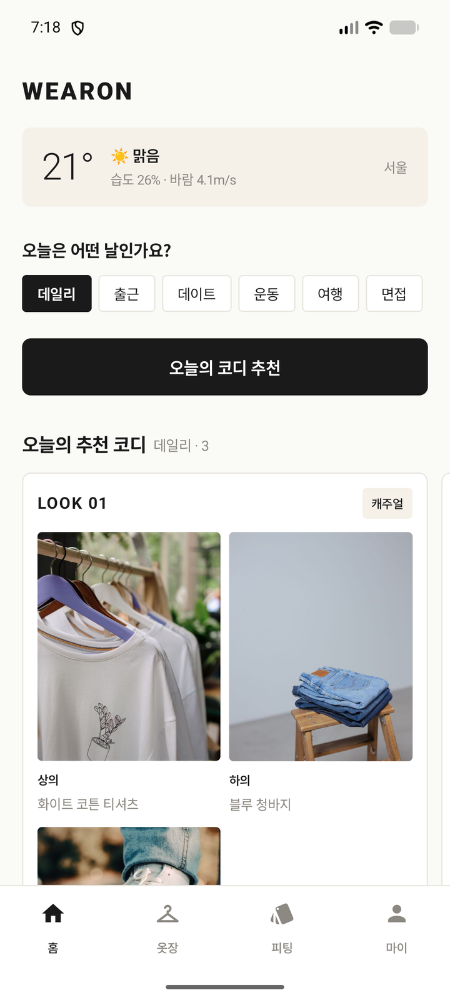
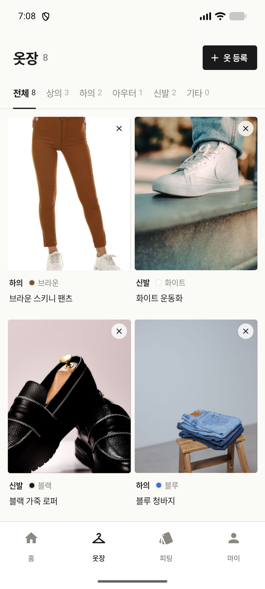
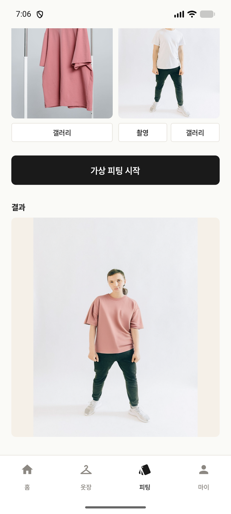
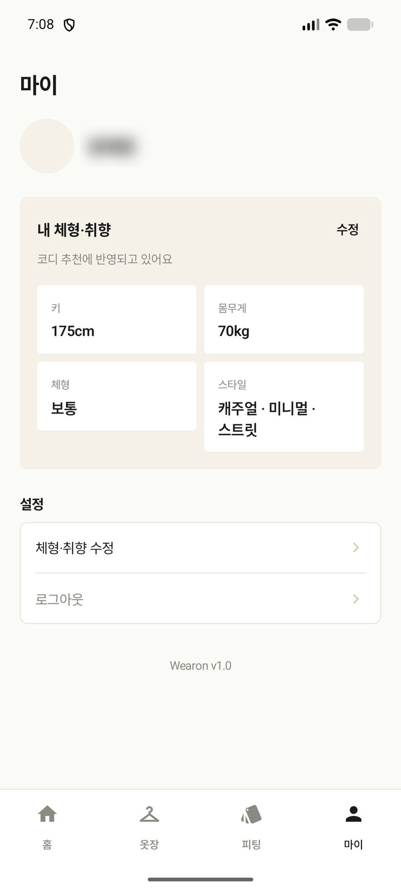
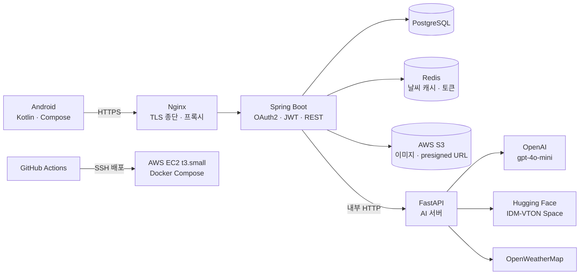
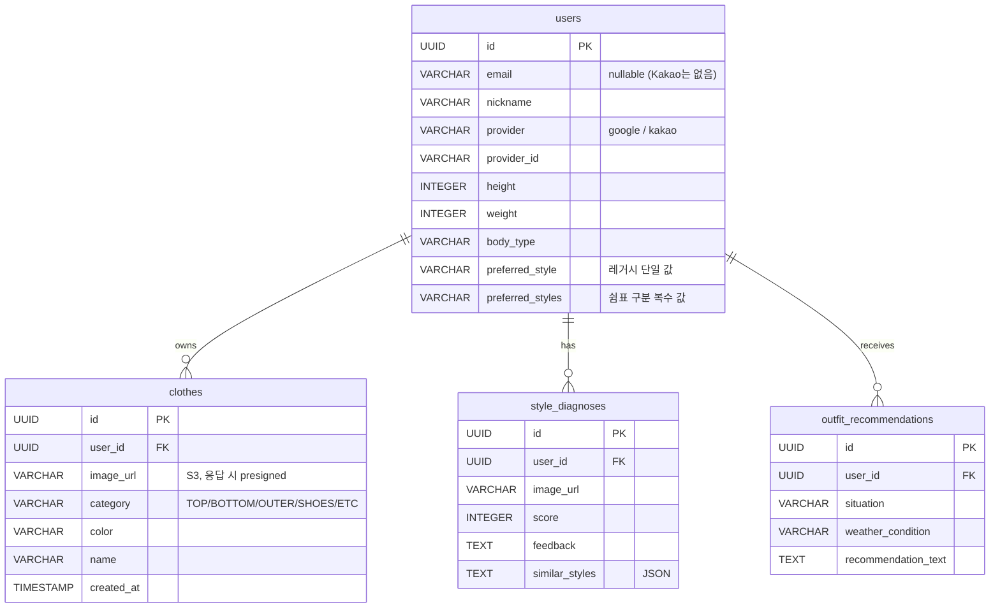

# Wearon

> 내 옷장 기반 AI 코디 추천 + 쇼핑몰 상품 가상 피팅 Android 앱  
> 기획 · Android · 백엔드 · AI 서버 · 인프라까지 혼자 만들고 운영 서버에 배포한 풀스택 프로젝트

- **API 서버**: `https://fashion-app-jh.duckdns.org` (HTTPS, Let's Encrypt)
- **클라이언트**: Android (Kotlin, Jetpack Compose) — Play Store 등록 준비 중
- **개발 기록**: [`CLAUDE.md`](CLAUDE.md)의 개발 일지, 트러블슈팅은 [`docs/troubleshooting.md`](docs/troubleshooting.md)

> 비용 관리를 위해 EC2 인스턴스를 중지해 두는 기간이 있어, 그동안은 API가 응답하지 않을 수 있습니다.

| 홈 | 옷장 | 피팅 | 마이 |
|:---:|:---:|:---:|:---:|
|  |  |  |  |

---

## 목차

- [무엇을 하는 앱인가요](#무엇을-하는-앱인가요)
- [주요 기능](#주요-기능)
- [아키텍처](#아키텍처)
- [기술 스택](#기술-스택)
- [핵심 설계 결정](#핵심-설계-결정)
- [성능 개선과 측정](#성능-개선과-측정)
- [인프라와 배포](#인프라와-배포)
- [트러블슈팅 하이라이트](#트러블슈팅-하이라이트)
- [ERD](#erd)
- [API 명세](#api-명세)
- [프로젝트 구조](#프로젝트-구조)
- [실행 방법](#실행-방법)
- [테스트](#테스트)
- [로드맵](#로드맵)

---

## 무엇을 하는 앱인가요

패션에 자신 없는 사람도 **내가 가진 옷만으로** 오늘 입을 코디를 받을 수 있게 만든 앱입니다.

옷 사진을 올리면 AI가 카테고리·색상·이름을 자동으로 분류해 옷장을 만들고, 날씨와 상황(출근, 데이트 등)과 체형·선호 스타일을 반영해 내 옷장 안에서 코디 조합을 추천합니다. 사고 싶은 옷은 쇼핑몰 상품 주소만 붙여 넣으면 내 전신 사진에 입혀 볼 수 있습니다.

2026년 7월에 "옷장 관리 + 가상 피팅" 앱에서 "등록 없이 바로 추천받는 앱"으로 방향을 바꿨다가, 9월에 **AI 자동 분류로 등록 부담을 줄인 새 방식의 옷장**을 다시 도입하며 Wearon으로 리브랜딩했습니다. 옷 등록이 번거롭다는 진입장벽은 자동 분류, 다중 선택 등록, 상품 URL 등록으로 낮췄습니다.

---

## 주요 기능

하단 탭은 홈 / 옷장 / 피팅 / 마이로 구성됩니다.

| 탭 | 기능 |
|------|------|
| 로그인 | Google / Kakao 소셜 로그인, JWT 인증 |
| 홈 | 날씨 + 상황 칩(데일리·출근·데이트·운동·여행·면접) 선택 → **내 옷장 옷으로 만든 코디 조합 카드**(LOOK 01, 02… 스와이프, 추천 이유 포함). 옷장이 비어 있으면 등록 안내 |
| 옷장 | 카메라 촬영, 갤러리 **다중 선택(최대 10장)**, **쇼핑몰 상품 주소로 등록**. AI가 카테고리·색상·이름을 자동 분류. 카테고리 탭과 2열 그리드, 삭제 |
| 피팅 | 쇼핑몰 상품 URL(무신사 앱 공유 링크 포함) → 옷 이미지 추출 → 내 전신 사진과 합성하는 **가상 피팅** |
| 마이 | 키·몸무게·체형·**선호 스타일(복수 선택)** 설정, 프로필 요약 |

> 내 옷 진단(코디 사진 → 점수·개선 제안)과 쇼핑 도우미(예산·상황 → 아이템 추천) API와 화면 코드는 남아 있지만, 현재 탭에는 노출하지 않습니다. 쇼핑 도우미는 피팅 탭에 통합할지 검토 중입니다.

---

## 아키텍처


```mermaid
flowchart LR
    A["Android<br/>Kotlin · Compose"] -->|HTTPS| N["Nginx<br/>TLS 종단 · 프록시"]
    N --> S["Spring Boot<br/>OAuth2 · JWT · REST"]
    S --> P[("PostgreSQL")]
    S --> R[("Redis<br/>날씨 캐시 · 토큰")]
    S --> S3[("AWS S3<br/>이미지 · presigned URL")]
    S -->|내부 HTTP| F["FastAPI<br/>AI 서버"]
    F --> O["OpenAI<br/>gpt-4o-mini"]
    F --> H["Hugging Face<br/>IDM-VTON Space"]
    F --> W["OpenWeatherMap"]
    G["GitHub Actions"] -->|SSH 배포| E["AWS EC2 t3.small<br/>Docker Compose"]
```

- 모든 서버(Nginx, Spring Boot, FastAPI, PostgreSQL, Redis)는 **EC2 t3.small 한 대에 Docker Compose로** 올라갑니다.
- 클라이언트는 Spring Boot만 호출하고, AI 서버는 내부망에서 Spring Boot만 호출합니다.
- 이미지는 S3에 저장하고, 응답에는 만료되는 **presigned URL**을 내려줍니다.

---

## 기술 스택

| 영역 | 기술 |
|------|------|
| Android | Kotlin, Jetpack Compose, Hilt, Retrofit/OkHttp, Coil, DataStore, Navigation Compose |
| 백엔드 | Spring Boot (Java 17), Spring Security OAuth2 Client, JWT, JPA, Caffeine + Redis |
| AI 서버 | FastAPI (Python), OpenAI gpt-4o-mini (텍스트·Vision), Hugging Face IDM-VTON(`gradio_client`) |
| 데이터 | PostgreSQL, Redis, AWS S3 |
| 인프라 | AWS EC2, Docker Compose, Nginx, Let's Encrypt, GitHub Actions, DuckDNS, Elastic IP |
| 외부 API | OpenWeatherMap(날씨), Google·Kakao OAuth2 |
| 테스트·측정 | JUnit5, Mockito, k6 |

---

## 핵심 설계 결정

### 1. 옷장 기반 추천은 서버가 옷을 직접 조회하고, AI 응답을 검증한다

`POST /api/outfits/recommend/closet`은 클라이언트가 옷 목록을 보내지 않습니다. 서버가 JWT의 사용자 기준으로 **DB에서 옷을 직접 조회**해 AI에 넘기므로, 남의 옷이나 존재하지 않는 옷이 섞일 수 없습니다.

- 프롬프트에는 긴 UUID 대신 `C1, C2…` 같은 짧은 코드로 옷을 넘기고, 응답에서 원래 ID로 복원합니다. AI가 긴 ID를 틀리게 옮기는 문제를 피하기 위해서입니다.
- 목록에 없는 코드는 AI 서버에서 한 번, 백엔드에서 한 번 더 걸러내고, **2벌 미만 조합은 버립니다.**

### 2. 옷 등록은 "분류 먼저, 업로드 나중"

AI 분류 → S3 업로드 → DB 저장 순서로 처리해, 분류가 실패한 사진이 **S3에 고아 파일로 남지 않게** 했습니다. 삭제는 DB를 먼저 지우고 S3 삭제는 best-effort로 처리해, 스토리지 오류가 사용자 요청을 실패시키지 않게 했습니다.

갤러리에서 여러 장을 고르면 **한 장씩 순차 등록**합니다. 동시에 보내면 OpenAI 분당 토큰 한도(TPM)에 걸려 대부분 500이 났기 때문입니다. 분류 요청은 `detail: "low"`로 낮춰 40장 연속 분류에서 에러 0건을 확인했습니다.

### 3. 상품 페이지 이미지 추출은 서버가 아니라 앱에서 한다

임의의 URL을 서버가 대신 요청하면 내부 메타데이터 주소(`169.254.169.254` 등)로 향하는 **SSRF 통로**가 됩니다. 그래서 상품 페이지의 `og:image`, `twitter:image`, JSON-LD 이미지 추출은 앱이 수행하고, 외부 쇼핑몰 요청에는 JWT가 붙지 않도록 인증 없는 별도 OkHttpClient를 씁니다.

무신사 앱의 공유 링크(OneLink)는 요청 UA에 따라 응답이 달라서 별도 처리했습니다(아래 트러블슈팅). 이 구간에만 `https` 강제와 허용 도메인 검사를 적용해 최대 3단계까지 리다이렉트를 직접 따라갑니다.

### 4. 가상 피팅은 외부 모델 프록시로 만들고, 사진은 저장하지 않는다

GPU 서버를 직접 운영하는 대신 Hugging Face Space(IDM-VTON)를 `gradio_client`로 호출합니다. 사용자의 **전신 사진은 S3에 저장하지 않고** AI 서버로 전달한 뒤 폐기하며, 결과 이미지만 S3에 올려 presigned URL로 응답합니다. 사람 전신 사진이라는 민감도를 고려해 저장 범위를 최소화했습니다.

응답이 20~30초 걸리는 요청이라 **타임아웃을 계층별로 맞췄습니다.** 앱(OkHttp)은 `/api/vton`만 read 180초, Nginx도 해당 경로만 180초로 늘리고, 나머지 API는 10초를 유지해 서버가 멈췄을 때 빨리 실패하게 했습니다.

### 5. 무중단 호환을 위한 "추가만 하는" DB 마이그레이션

선호 스타일을 단일 값에서 복수 선택으로 바꿀 때, 기존 `preferred_style` 컬럼은 건드리지 않고 `preferred_styles`만 **추가**했습니다.

- 새 컬럼이 `NULL`이면 기존 단일 값으로 폴백해서 읽으므로 백필 없이도 기존 사용자 데이터가 유지됩니다.
- 저장할 때 첫 값을 기존 컬럼에도 같이 기록해, 옛 앱 버전과 롤백에도 호환됩니다.
- 로그인(OAuth)마다 프로필 필드를 갱신하는 경로가 새 컬럼을 덮어쓰지 않는지 테스트로 고정했습니다.
- 서버를 먼저 배포한 뒤 새 앱을 설치하는 순서를 지켰고, 배포 직전 `pg_dump`로 운영 DB를 백업했습니다.

---

## 성능 개선과 측정

### 옷 등록 속도 (구간별 로그로 측정 후 개선)

개선 전에 어느 구간이 느린지 추정하지 않고 실측하려고, Spring에 구간별 로그(분류·S3·DB)를 넣고 Nginx에 `rt`(전체)/`urt`(Spring) 로그를 추가했습니다. 병목은 AI 분류(요청의 약 75%)와 원본 이미지 업로드였고, 앱에서 업로드 전에 **긴 변 1024px, JPEG q80으로 리사이즈·압축**했습니다(EXIF 회전 유지, 실패 시 원본으로 폴백).

| 항목 (2.2MB 카메라급 이미지 1장) | 개선 전 | 개선 후 |
|------|------:|------:|
| 업로드 크기 | 2,273KB | 약 80KB |
| AI 분류 | 2.7s | 1.5s |
| S3 업로드 | 약 765ms | 약 60ms |
| 요청 전체 | 4.3s | 1.5s |

> 에뮬레이터(PC 회선)에서 이미지 1장으로 측정한 값입니다. 모바일 업링크에서는 원본 크기에 비례하는 업로드 구간의 비중이 더 커질 것으로 예상합니다. 등록 중에는 "사진 최적화 → 업로드 % → AI 분류" 단계별 진행 표시를 보여줍니다.

### 백엔드 응답 시간 (EC2 t3.small, k6)

| 항목 | 내용 | 효과 |
|------|------|------|
| 인덱스 | `users.email`, `users.provider_id`, `clothes.user_id` 인덱스, `EXPLAIN ANALYZE`로 확인 | 조회 쿼리 개선 |
| 비동기 처리 | AI 서버 호출을 전용 Executor에서 `CompletableFuture`로 병렬 실행 | 응답 시간 25~32% 개선 |
| 2단계 캐싱 | 날씨 API를 Caffeine(10분) → Redis(30분) → 외부 API 순으로 조회 | 캐시 히트 시 7ms (97% 개선) |
| HikariCP / JVM | `maximum-pool-size: 10`, `-Xmx512m -XX:+UseSerialGC` 등 2GB 인스턴스에 맞춘 보수적 튜닝 | 메모리 약 281~286MB로 안정 |

| 측정 항목 | 결과 |
|------|------|
| DB 읽기 API 평균 응답 | 18ms |
| 날씨 API 평균 (캐시 히트) | 7ms |
| 동시 사용자 50명 부하 테스트 평균 응답 | 93ms, 43.8 req/s, 오류율 0% (5분, 13,148건) |

> 위 k6 수치는 7월 기준 측정입니다. 스크립트는 [`performance/`](performance)에 있습니다.

---

## 인프라와 배포

- **CI/CD**: `dev` 브랜치에 push하면 GitHub Actions가 EC2에 SSH로 접속해 `git pull` → `docker compose up -d --build`를 실행하고, 이어서 Nginx를 재시작합니다.
- **HTTPS**: Let's Encrypt 인증서(webroot HTTP-01)를 Nginx에서 종단합니다. 인증서 발급은 **2단계 배포**(1단계: 챌린지 경로 + 443 포트 → 서버에서 발급, 2단계: HTTPS 서버 블록 + 80→443 리다이렉트)로 서비스 중단 없이 전환했습니다.
- **인증서 자동 갱신**: EC2 crontab이 매일 새벽 갱신 스크립트를 실행하고, 갱신되면 Nginx를 reload합니다. 갱신 실패에 대비해 인증서 계정에 알림 메일도 등록했습니다. ([`infra/certbot`](infra/certbot))
- **리다이렉트는 308**: 301은 OkHttp가 POST를 GET으로 바꿔 옛 앱 버전의 POST 요청이 깨질 수 있어 308을 썼습니다.
- **고정 IP**: Elastic IP를 연결하고 DuckDNS로 도메인을 연결했습니다. ([`infra/duckdns`](infra/duckdns))
- **Android 빌드 분리**: `debug`는 로컬 서버(`10.0.2.2`), `release`는 운영 HTTPS 도메인을 바라보며, release는 별도 키스토어로 서명합니다. 시크릿(`.env`, 키스토어, 인증서 개인키)은 git에 올리지 않습니다.

---

## 트러블슈팅 하이라이트

더 많은 사례는 [`docs/troubleshooting.md`](docs/troubleshooting.md)와 `CLAUDE.md` 개발 일지에 있습니다.

| 증상 | 원인 | 해결 |
|------|------|------|
| 무신사 앱 공유 링크(`onelink.me`)를 넣으면 이미지를 못 가져옴 | OneLink가 UA에 따라 응답이 다름. 모바일 UA에는 리다이렉트 없는 중계 HTML(JS로 앱 실행 시도)을, 데스크톱 UA에는 실제 페이지로 301을 줌 | OneLink일 때만 데스크톱 UA로 리다이렉트를 한 단계씩 직접 따라가고, 매 단계 `https`·허용 도메인을 검사 |
| Kakao 로그인 후 "인증이 필요합니다" | Kakao는 이메일 동의 항목이 없는데 `UserPrincipal`이 이메일을 username으로 써서 Spring Security의 `principalName`이 null이 됨 (Google은 항상 이메일이 있어 드러나지 않음) | 이메일이 없으면 사용자 ID를 username으로 사용하고 단위 테스트 추가 |
| HTTPS 전환 후 OAuth 로그인 실패 가능성 | Nginx 뒤에서 Spring이 `redirect_uri`를 `http://`로 생성 | `server.forward-headers-strategy: framework` 설정과 `X-Forwarded-*` 헤더 전달 |
| 가상 피팅이 서버에서는 200인데 앱에서는 타임아웃 | OkHttp 기본 read 타임아웃 10초. 이전 검증을 curl로만 해서 놓침 | `/api/vton`만 180초로 늘리는 인터셉터 + Nginx 해당 경로 180초 |
| Nginx 설정을 바꿨는데 서버에 반영 안 됨 | 단일 파일 바인드 마운트라 `git pull`이 파일을 교체하면 컨테이너가 옛 inode를 계속 잡고 있음 | 배포 스크립트에 `restart nginx` 추가 |
| 배포가 실패했는데 Actions는 성공(✓)으로 표시 | 배포 스크립트에 `set -e`가 없어 `git pull` 실패 후에도 옛 코드로 빌드가 진행됨 | 배포 로그에서 pull 성공 여부를 확인하는 절차 추가 |

---

## ERD


```mermaid
erDiagram
    users ||--o{ clothes : owns
    users ||--o{ style_diagnoses : has
    users ||--o{ outfit_recommendations : receives

    users {
        UUID id PK
        VARCHAR email "nullable (Kakao는 없음)"
        VARCHAR nickname
        VARCHAR provider "google / kakao"
        VARCHAR provider_id
        INTEGER height
        INTEGER weight
        VARCHAR body_type
        VARCHAR preferred_style "레거시 단일 값"
        VARCHAR preferred_styles "쉼표 구분 복수 값"
    }
    clothes {
        UUID id PK
        UUID user_id FK
        VARCHAR image_url "S3, 응답 시 presigned"
        VARCHAR category "TOP/BOTTOM/OUTER/SHOES/ETC"
        VARCHAR color
        VARCHAR name
        TIMESTAMP created_at
    }
    style_diagnoses {
        UUID id PK
        UUID user_id FK
        VARCHAR image_url
        INTEGER score
        TEXT feedback
        TEXT similar_styles "JSON"
    }
    outfit_recommendations {
        UUID id PK
        UUID user_id FK
        VARCHAR situation
        VARCHAR weather_condition
        TEXT recommendation_text
    }
```

> `clothes.category`는 enum 컬럼이 아니라 문자열로 저장하고, 읽을 때 모르는 값은 `ETC`로 처리합니다. 운영 DB에 피봇 이전 옛 `clothes` 테이블이 남아 있어도 조회가 깨지지 않게 하기 위한 선택입니다.

---

## API 명세

🔒 = JWT 인증 필요

| 영역 | Method | Endpoint | 설명 |
|------|--------|----------|------|
| Auth | GET | `/oauth2/authorization/{google,kakao}` | 소셜 로그인 시작 |
| Auth | POST | `/api/auth/refresh` | JWT 갱신 |
| Auth | POST | `/api/auth/logout` | 로그아웃 |
| User 🔒 | GET / PUT | `/api/users/me` | 프로필 조회 / 수정 (체형, 선호 스타일 복수) |
| Weather 🔒 | GET | `/api/weather` | 현재 날씨 (2단계 캐시) |
| Clothes 🔒 | POST | `/api/clothes` | 옷 사진 → AI 분류 → S3 → 저장 |
| Clothes 🔒 | GET | `/api/clothes` | 내 옷 목록 (최신순, presigned URL) |
| Clothes 🔒 | DELETE | `/api/clothes/{id}` | 옷 삭제 |
| Outfit 🔒 | POST | `/api/outfits/recommend/closet` | 날씨 + 상황 + 프로필 + **내 옷장** → 코디 조합 (홈 탭) |
| Outfit 🔒 | POST | `/api/outfits/recommend/situation` | 옷장 무관 텍스트 추천 (k6 측정용) |
| Vton 🔒 | POST | `/api/vton` | 전신 사진 + 옷 사진 → 가상 피팅 결과 이미지 |
| Diagnosis 🔒 | POST / GET | `/api/diagnosis`, `/api/diagnosis/{id}` | 코디 사진 진단 (탭 미노출) |
| Shopping 🔒 | POST | `/api/shopping/recommend` | 예산 + 상황 → 아이템 추천 (탭 미노출) |

AI 서버(FastAPI)는 Spring Boot만 호출하는 내부 전용이며 `/ai/clothes/classify`, `/ai/outfits/recommend/closet`, `/ai/vton`, `/ai/weather` 등을 제공합니다.

---

## 프로젝트 구조

```
my-fashion-app/
├── android/                 # Kotlin + Jetpack Compose
│   └── app/src/main/java/com/fashionapp/
│       ├── data/            # api(Retrofit), repository, datastore, image(압축)
│       ├── di/              # Hilt 모듈
│       └── ui/              # home, closet, fitting, mypage, login, theme, navigation
├── backend/                 # Spring Boot
│   └── src/main/java/com/fashionapp/
│       ├── domain/          # user, weather, outfit, clothes, vton, diagnosis, shopping
│       ├── global/          # config, jwt, exception
│       └── infra/           # S3Uploader, AiServerClient
├── ai-server/               # FastAPI
│   └── app/                 # routers, services, schemas, core
├── nginx/                   # nginx.conf (TLS, 프록시, 타임아웃, 접근 로그)
├── infra/                   # certbot(인증서 발급·갱신), duckdns
├── performance/             # k6 스크립트
├── docs/                    # troubleshooting.md
├── .github/workflows/       # deploy.yml (CI/CD)
├── docker-compose.yml       # 로컬 (Redis, AI 서버)
├── docker-compose.prod.yml  # 운영 (Nginx, Spring Boot, AI 서버, PostgreSQL, Redis)
└── CLAUDE.md                # 설계 기록과 개발 일지
```

---

## 실행 방법

### 사전 요구사항

Docker, Java 17+, Android Studio (에뮬레이터 또는 실기기)

### 1. 환경변수

`backend/.env`에 DB 접속 정보, Google·Kakao OAuth 클라이언트 ID/시크릿, `JWT_SECRET`, AWS 키와 S3 버킷 이름을 설정합니다. `ai-server/.env`는 `.env.example`을 참고하세요.

```env
OPENAI_API_KEY=...
WEATHER_API_KEY=...    # OpenWeatherMap
HF_API_TOKEN=...       # 선택 (공개 Space라 없어도 호출 가능)
```

> `.env`, 키스토어, 인증서 개인키는 저장소에 올리지 않습니다.

### 2. PostgreSQL, Redis, AI 서버

```bash
docker run -d --name fashionapp-db -p 5432:5432 \
  -e POSTGRES_DB=fashionapp -e POSTGRES_USER=fashionapp -e POSTGRES_PASSWORD=fashionapp \
  postgres:16
docker compose up -d
# AI 서버 코드를 수정했다면 재빌드해야 반영됩니다
docker compose build ai-server && docker compose up -d ai-server
```

### 3. 백엔드

```bash
cd backend
./gradlew bootRun    # http://localhost:8080
```

### 4. Android

Android Studio에서 `android/` 폴더를 열어 에뮬레이터로 실행합니다. 에뮬레이터에서 소셜 로그인을 테스트하려면 포트포워딩이 필요합니다. (Google·Kakao 콘솔은 redirect URI에 사설 IP를 허용하지 않아 `localhost`를 씁니다.)

```bash
adb reverse tcp:8080 tcp:8080
```

---

## 테스트

JUnit5 + Mockito로 작성한 백엔드 테스트가 30건 이상이며(마지막 전체 실행 기준 모두 통과), 주요 검증은 아래와 같습니다.

- 날씨 캐시(로컬 히트/미스, Redis 히트, 캐시 손상 시 폴백)
- 코디 추천(옷장 기반 추천 포함, 내 옷장에 없는 ID와 2벌 미만 조합 제거)
- 옷장(AI 분류 실패 시 S3 업로드 안 함 등)
- 사용자 프로필(선호 스타일 폴백·빈 목록·잘못된 값·로그인 시 보존), `UserPrincipal`
- 컨트롤러 계층 `@WebMvcTest`

---

## 로드맵

- [x] 소셜 로그인(Google, Kakao), JWT, 체형·선호 스타일 프로필
- [x] AI 옷 분류 기반 옷장 (카메라, 다중 선택, 상품 URL 등록)
- [x] 내 옷장 기반 코디 추천
- [x] 쇼핑몰 URL 가상 피팅 (OneLink 공유 링크 지원)
- [x] EC2 + Docker + CI/CD, HTTPS(Let's Encrypt) 전환
- [x] 성능 개선(캐싱·비동기·이미지 압축)과 구간별 측정
- [ ] Play Store 등록 (개인정보처리방침, 스토어 등록 정보)
- [ ] 인증서 자동 갱신의 실제 갱신 동작 확인
- [ ] 쇼핑 도우미를 피팅 탭에 통합
- [ ] 운영 DB의 옛 `clothes` 테이블 정리
- [ ] 가상 피팅 품질 개선(입력 사진 가이드, 전처리)

---

## 라이선스

MIT License
